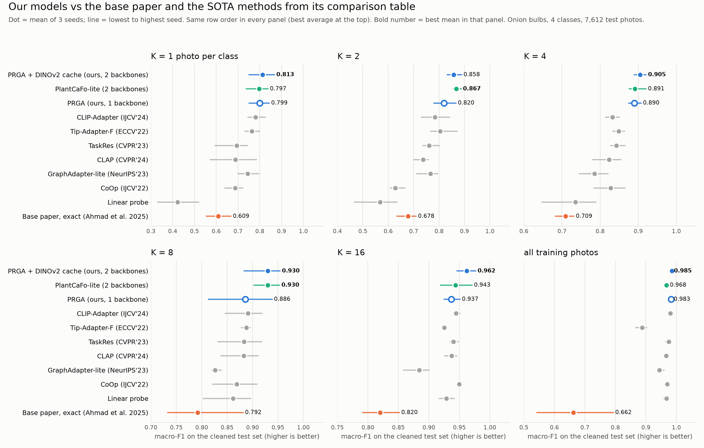

# Few-shot onion bulb grading with CLIP

Classifying onion bulb photos into four classes (healthy / unhealthy × red / white) from **1 to 16 labelled photos per
class**, on frozen vision-language features. The repository contains:

- **a leak-free evaluation protocol** for the public onion bulb dataset (duplicate removal, same-scene detection,
  object-disjoint purged split);
- **an exact replication** of Ahmad et al., *Advancing Cache-Based Few-Shot Classification via Patch-Driven Relational
  Gated Graph Attention* (arXiv:2512.12498, 2025), including its ablations;
- **re-implementations of the methods in that paper's comparison table** (Tip-Adapter-F, TaskRes, GraphAdapter,
  CLIP-Adapter, CLAP) plus CoOp, PlantCaFo-style multi-backbone caching, BioCLIP, SCOLD and a fine-tuned CNN;
- **PRGA** (Prompt-grounded Region Graph Adapter) and a two-backbone variant, **PRGA + DINOv2 cache**.

All results: macro-F1 on 7,612 held-out test photos, mean ± std over 3 random support sets. Every design choice and
hyper-parameter was selected on validation data; the test set was evaluated once per configuration.

## Results

| method | backbones | K=1 | K=2 | K=4 | K=8 | K=16 | all (≈1.8k) |
|---|---|---|---|---|---|---|---|
| **PRGA + DINOv2 cache** | CLIP + DINOv2 | **0.813** ± .059 | 0.858 ± .029 | **0.905** ± .016 | **0.930** ± .040 | **0.962** ± .016 | **0.985** ± .001 |
| **PRGA** | CLIP | 0.799 ± .047 | 0.820 ± .044 | 0.890 ± .017 | 0.886 ± .065 | 0.937 ± .013 | 0.983 ± .002 |
| PlantCaFo-style cache | CLIP + DINOv2 | 0.797 ± .053 | **0.867** ± .017 | 0.891 ± .026 | **0.930** ± .025 | 0.943 ± .026 | 0.968 ± .005 |
| CoOp | CLIP | 0.687 ± .042 | 0.628 ± .033 | 0.828 ± .042 | 0.869 ± .044 | 0.950 ± .002 | 0.970 ± .009 |
| CLIP-Adapter | CLIP | 0.780 ± .041 | 0.783 ± .055 | 0.833 ± .019 | 0.891 ± .039 | 0.944 ± .006 | 0.980 ± .004 |
| TaskRes | CLIP | 0.694 ± .086 | 0.761 ± .035 | 0.843 ± .020 | 0.884 ± .045 | 0.940 ± .007 | 0.975 ± .010 |
| CLAP | CLIP | 0.689 ± .108 | 0.737 ± .032 | 0.823 ± .039 | 0.883 ± .040 | 0.937 ± .010 | 0.967 ± .004 |
| Tip-Adapter-F | CLIP | 0.764 ± .033 | 0.804 ± .058 | 0.849 ± .016 | 0.888 ± .009 | 0.925 ± .003 | 0.888 ± .019 |
| GraphAdapter (single-layer variant) | CLIP | 0.745 ± .048 | 0.767 ± .047 | 0.785 ± .038 | 0.826 ± .011 | 0.884 ± .023 | 0.945 ± .014 |
| Ahmad et al. 2025 (replication) | CLIP | 0.609 ± .057 | 0.678 ± .039 | 0.709 ± .024 | 0.792 ± .079 | 0.820 ± .030 | 0.662 ± .126 |
| Linear probe | CLIP | 0.423 ± .095 | 0.568 ± .089 | 0.736 ± .077 | 0.862 ± .052 | 0.929 ± .012 | 0.967 ± .011 |
| EfficientNet-B0, fine-tuned | — | 0.270 ± .014 | 0.326 ± .045 | 0.422 ± .052 | 0.488 ± .046 | 0.550 ± .020 | 0.892 ± .018 |
| Tip-Adapter-F on BioCLIP | BioCLIP | 0.397 ± .039 | 0.470 ± .006 | 0.511 ± .041 | 0.577 ± .048 | 0.708 ± .050 | 0.591 ± .034 |
| Tip-Adapter-F on SCOLD | SCOLD | 0.216 ± .032 | 0.237 ± .022 | 0.325 ± .044 | 0.474 ± .011 | 0.630 ± .035 | 0.434 ± .046 |

Zero-shot CLIP: 0.751 with the class descriptions used by PRGA, 0.553 with generic templates, 0.548 with
"a photo of a [CLASS]". With 3 seeds, differences below about 2 points are not significant.



**Summary.** PRGA + DINOv2 cache is first or tied for first at every K except K = 2, where the PlantCaFo-style cache is
0.9 points ahead (within the seed spread). Among single-backbone methods, PRGA is best at K = 1, 2, 4 and with all data.
Every method from the base paper's comparison table outperforms the base paper's own model on this dataset.

## Method

```
photo ─┬─ CLIP ViT-B/16 ──────────────────────────────────► CLIP cache   (keys: graph-refined support photos) ─┐
       ├─ DINOv2-S ───────────────────────────────────────► DINOv2 cache (keys fine-tuned on support views)   ─┤
       └─ OWLv2 (text prompts) ─► boxes ─► CLIP on crops ─► PRGA graph ─► image-conditioned class prototypes  ─┼─► score
class descriptions ─► CLIP text encoder ─┬─► text nodes of the PRGA graph                                       │
                                         └─► zero-shot term ───────────────────────────────────────────────────┘
```

**PRGA** builds one fully connected graph per photo with up to 10 nodes: the whole photo, the OWLv2 object box, up to four
OWLv2 regions (onion instances and lesion spots, found with text prompts) and the four class descriptions. Two layers of
multi-head gated graph attention (edge features: cosine similarities; a sigmoid gate mixes each node's message with its
previous state; layer normalisation) update the nodes. A readout produces a refined photo embedding, used as cache keys
for the support photos, and the text nodes become image-conditioned class prototypes. The class score is

```
score_c = 100 f·T_c  +  α Σ_j exp(−β(1 − f·K_j)) L̃_jc  +  γ 100 f·T̂_c  [+ a₂ Σ_j exp(−b₂(1 − d·D_j)) L̃_jc]
          zero-shot      CLIP cache (class-balanced)       prototypes      DINOv2 cache (two-backbone variant)
```

with `f` the photo's CLIP embedding, `T` the class-description embeddings, `T̂` the refined prototypes, `d` the DINOv2
embedding and `L̃` class-balanced one-hot labels. α, β, γ are learned; the final α, β and the DINOv2 weights a₂, b₂ are
chosen on validation data. The class descriptions are eight short visual descriptions per class
(`prompts/descriptors.json`). 1.1 M trainable parameters; all backbones are frozen.

## Evaluation protocol

The dataset (Kulkarni et al., Mendeley Data 2025, DOI 10.17632/42bcyncfhy.1, CC BY 4.0; 12,260 bulb photos) contains
many re-shots of the same onions and scenes. Before splitting:

1. integrity check and removal of 27 byte-identical duplicates (MD5);
2. same-scene detection on 1.4 M candidate pairs: RootSIFT keypoints, GPU mutual-nearest-neighbour matching with a ratio
   test, RANSAC homography (≥ 10 inliers); 79,194 verified pairs, none across classes;
3. removal of 557 near-identical burst frames → **11,676 photos**;
4. Louvain communities on the same-scene graph, a pool of 20 % stratified by class × single/pile, and a purge of every
   test photo linked to the pool by a verified pair or a CLIP cosine ≥ 0.95 → pool 2,388, **test 7,612**.

On a random split, 1-nearest-neighbour reaches 0.985 macro-F1; on this split 0.883. Details, thresholds and visual checks:
`docs/DATA_CLEANING.md`.

## Findings

**Base-paper replication** (`docs/BASE_PAPER_REPLICATION.md`). Implemented from the paper's equations and figures, with
every unspecified detail documented. On this dataset the graph does not help: the identical training recipe without the
graph scores higher at every K (14 of 18 runs), and the paper's attention ablations make no measurable difference. The
logs point to a train/test mismatch: the graph-refined training query and the plain CLIP test query have a cosine of
about 0.78, so training moves the cache keys away from where test photos lie.

**What drives PRGA** (`results/ablations_K1-4.csv`). Replacing the class descriptions with generic templates lowers K = 1
macro-F1 from 0.796 to 0.622; removing the class-text nodes lowers it to 0.769. Replacing the OWLv2 regions with the object
box alone or with a 3 × 3 grid makes no significant difference (0.789 / 0.799).

**Second backbone.** Adding a fine-tuned DINOv2 cache was selected on held-out halves of the validation sets (0.890 →
0.909) and improves PRGA in 16 of 18 seed-wise test comparisons (2 ties).

**Domain-specific backbones.** BioCLIP and SCOLD transfer poorly to bulbs; SCOLD's zero-shot score is below chance.

## Inference cost

Median time per photo, batch size 1 (`src/10_cost_benchmark.py`, `results/cost_benchmark.csv`):

| component | GPU (RTX 3050 Laptop, fp16) | CPU (8 threads) | parameters |
|---|---|---|---|
| CLIP ViT-B/16, whole photo | 8.9 ms | 170 ms | 86 M |
| CLIP ViT-B/16, 5 region crops | 21.9 ms | 761 ms | (shared) |
| DINOv2-S | 6.1 ms | 64 ms | 22 M |
| PRGA head | 1.3 ms | 0.7 ms | 1.1 M |
| OWLv2-B/16 detection | 126.9 ms | not measured | 155 M |

The full pipeline costs about 165 ms per photo on this GPU, of which OWLv2 accounts for about 77 %. Since the region nodes
did not measurably improve accuracy in the ablations, a variant without OWLv2 (CLIP + DINOv2 + head, about 16 ms per photo)
is the natural deployment candidate; its accuracy has not yet been validated end to end. Training the few-shot head takes
seconds once the frozen features are cached.

## Repository

```
src/
  00_clean_dataset.py, 00b_clean_inspect.py   cleaning and visual checks
  01_audit_dedup.py, 02_split.py              audit and the object-disjoint split
  03_regions_owlv2.py                         OWLv2 region boxes
  04_features.py, 04b_*, 04c_*                frozen CLIP / DINOv2 / BioCLIP / SCOLD features
  05_text.py                                  class text embeddings (templates and descriptions)
  basepaper.py, 06d_basepaper_exact.py        base-paper model and its training (+ ablations, no-graph control)
  06_baselines.py, sota.py, 06e_sota.py       baselines and comparison methods
  06b_*, 06c_*, fewshot_paper.py              controlled study: the paper's graph on different node types
  fewshot.py, 07_prga.py, 07b_*, 07c_*        PRGA, ablations, validation-only model selection
  08_cnn_baseline.py                          EfficientNet-B0
  09_eval.py, 09b_comparison_figure.py        tables and figures
  10_cost_benchmark.py                        inference cost
kaggle/                                       pipeline scripts and kernel entry points (Kaggle, 2 × T4)
docs/                                         data-cleaning protocol and base-paper replication report
prompts/  regions/  splits/  data/clean/  results/  figures/
```

## Reproduce

```
uv sync
# photos: data/raw/onion_bulbs/Onion Image Dataset/2. Bulb   (or set ONION_RAW)
cd src
python 01_audit_dedup.py && python 00_clean_dataset.py && python 02_split.py
python 03_regions_owlv2.py
python 04_features.py --backbone clip --mode global      # and the other feature steps in kaggle/run_pipeline.sh
bash ../kaggle/run_pipeline.sh                          # all methods, all K and seeds, tables and figures
python 07c_prga_improve.py                              # PRGA + DINOv2 cache: validation-only selection, then test
```

Every training step is resumable; finished (method, K, seed) runs are skipped.

## Limitations

- One dataset (one phone, one site, four classes); transfer to other crops and cameras is untested.
- Three seeds per setting; small differences are within noise.
- The base paper has no public code; its replication fills documented gaps.
- Comparison methods are re-implementations of each method's core formulation on frozen features, not the authors'
  code. Ta-Adapter and CAA were not re-implemented.
- Same-scene detection groups photos that share a textured background even when the onions differ, which makes the split
  conservative; a small fraction of test photos may still share an onion with training photos without a detectable
  geometric match.
- Image-level labels only.
