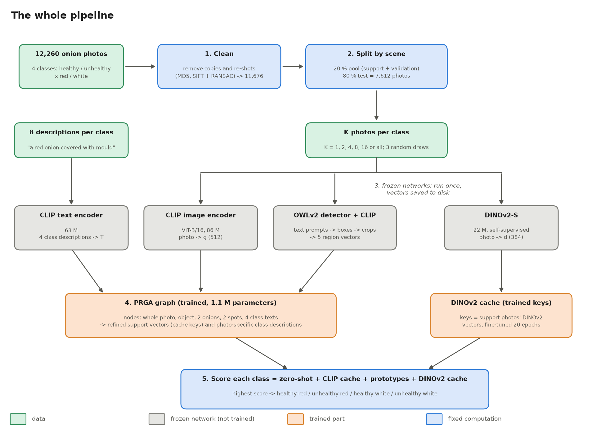
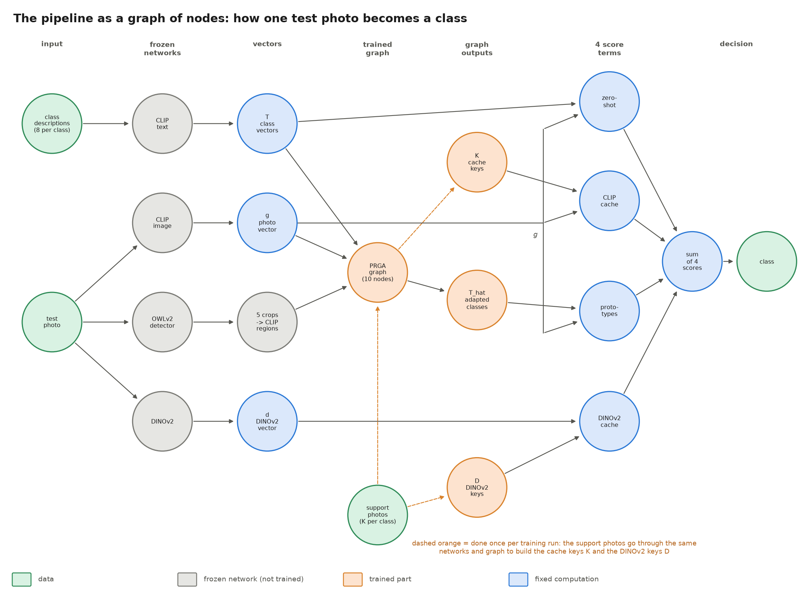
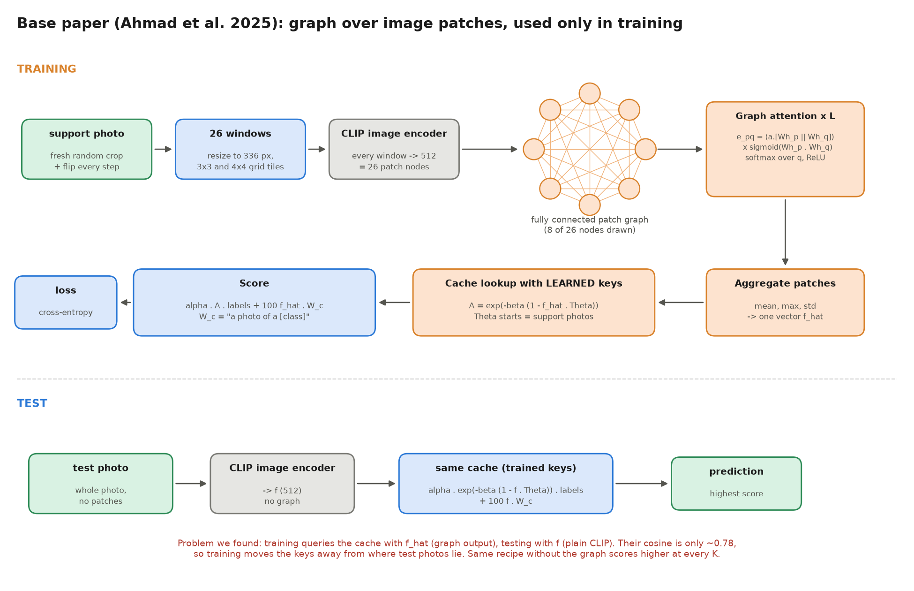
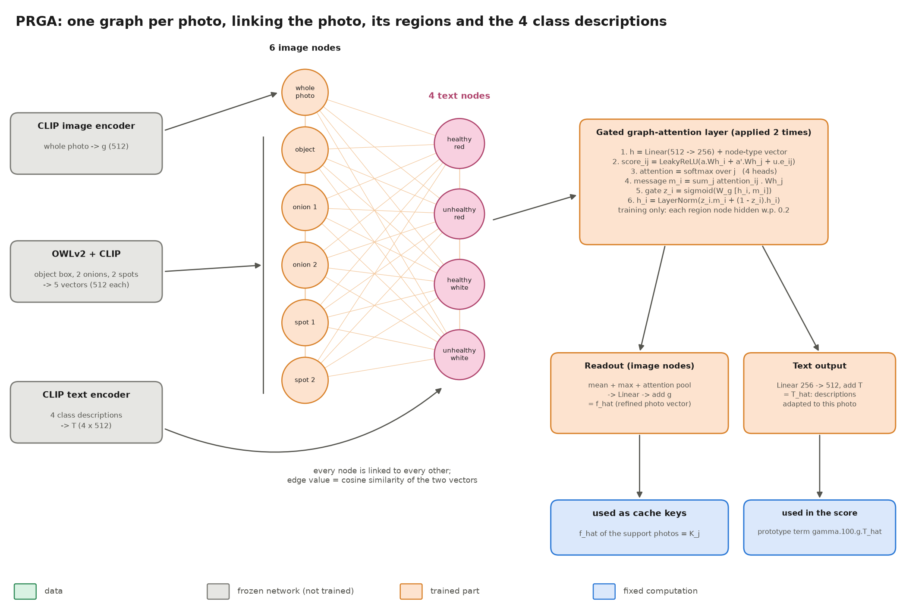
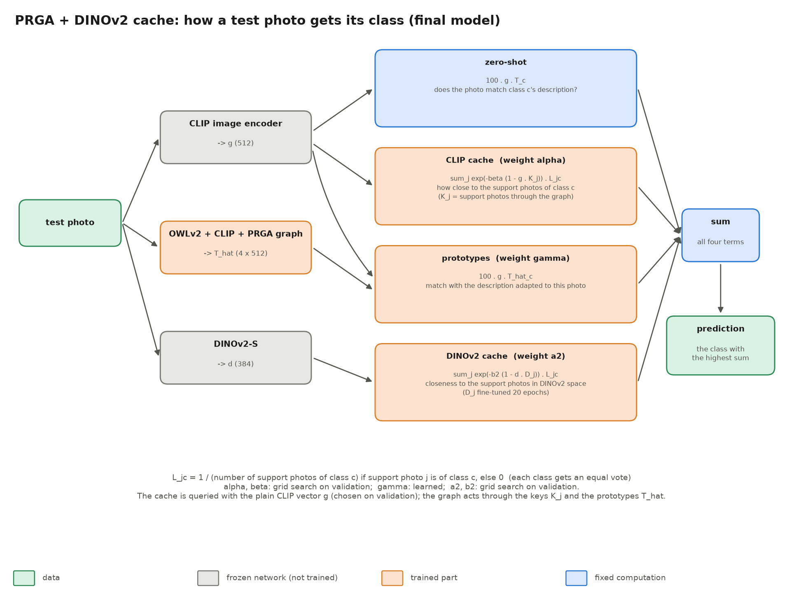

# The three models, explained with their code

This document explains the base paper's model, PRGA (our model) and PRGA + DINOv2 cache (our final model), one code
block at a time (code excerpts are slightly shortened; line numbers point to the full code). Every model rests on
one idea from Tip-Adapter, so that comes first.





## 0. The common idea: a cache of the training photos

CLIP turns a photo into a vector `g` (512 numbers, length 1) and a sentence into a vector `t`. Two vectors that point
the same way have cosine `g·t` close to 1.

- **Zero-shot:** score each class by how well the photo matches its description: `100 · g·t_c`.
- **Cache (Tip-Adapter):** also store the vectors of the support photos (the *keys* `K_j`) with their labels. A new
  photo looks at every stored photo; the closer it is, the more that photo's label counts:

```python
# src/fewshot.py, tip_logits
zs = 100 * q @ T.T                               # zero-shot: photo vs the 4 class descriptions
A = torch.exp(-beta * (1 - q @ keys.T))          # affinity to every support photo, between 0 and 1
return zs + alpha * A @ balance(L)               # each support photo votes for its own class
```

`1 − cos` is a distance (0 = identical). `exp(−β · distance)` turns it into a weight that falls off quickly; β sets how
quickly. `L` is the label matrix (one row per support photo, a 1 in its class column). `balance` divides each column by
the number of photos of that class, so every class gets an equal vote. α sets how much the cache counts compared with
zero-shot. Tip-Adapter-F additionally *trains* the keys.

All three models below are variations of this formula.

---

## 1. The base paper (Ahmad et al. 2025): `src/basepaper.py`, `src/09_base_paper.py`



**Idea.** Cut each training photo into 26 overlapping patches, link the patches in a graph, and let a graph-attention
network combine them into one better vector `f̂`. Use `f̂` to train the cache keys. At test time the graph is not used.

### 1a. The 26 patches (`basepaper.py`, lines 60-81)
```python
FIG2_WINDOWS = (_grid_windows(3, [(1, 1), (2, 3), (3, 2)])     # 3x3 grid: 9 single tiles, 2 tall, 2 wide
                + _grid_windows(4, [(2, 4), (4, 2), (3, 2)])   # 4x4 grid: 3 + 3 + 6 larger windows
                + [(0, 0, SIZE, SIZE)])                         # the whole photo
```
The photo is resized to 336 × 336 (`SIZE`). `_grid_windows(n, shapes)` lists every position of every window shape on
an n × n grid. 9 + 2 + 2 + 3 + 3 + 6 + 1 = 26 windows; each is resized to 224 and encoded by CLIP
(`WindowEncoder` in `09_base_paper.py`), giving 26 vectors per photo.

### 1b. One graph layer (`RelationalGatedLayer`, lines 83-107): the paper's Eq. 1-2
```python
Wh = self.W(h)                                                        # [B, 26, 512], W starts as the identity
att1 = (Wh @ self.a[:d])[:, :, None] + (Wh @ self.a[d:])[:, None, :]   # a·[Wh_p || Wh_q]   ("Attention 1", as in GAT)
att2 = torch.sigmoid(Wh @ Wh.transpose(1, 2))                         # sigmoid(Wh_p · Wh_q) ("Attention 2")
e = att1 * att2                                                       # combined score for every patch pair
alpha = torch.softmax(F.leaky_relu(e, 0.2), dim=-1)                   # attention weights, rows sum to 1
return self.rho(alpha @ Wh)                                           # each patch = weighted mix of all patches, ReLU
```
For every pair of patches (p, q) the layer computes how much p should listen to q, then replaces each patch vector by a
weighted average of all patches.

### 1c. From 26 patches to one vector (`MultiAggregation`, lines 120-146): Eq. 3
```python
return F.normalize(sum(g * lin(self.phi(m, h)) for g, lin, m in zip(self.gamma, self.W, self.psi)), dim=-1)
```
Take the mean, the max and the standard deviation over the 26 patches, pass each through a linear layer, mix them with
learned weights γ, and normalise. Result: `f̂`, one vector per photo.

### 1d. Training and testing (`Head`, lines 170-195): Eq. 4-5
```python
def train_logits(self, patches_all, alpha, beta):
    q = self.graph(patches_all[:, IDX[self.windows]])                  # training query = graph output f_hat
    return paper_logits(q, self.keys, self.L, self.W_c, alpha, beta)

def test_logits(self, f, alpha, beta, keys=None):                      # test query = plain CLIP vector, no graph
    return paper_logits(f, self.keys if keys is None else keys, self.L, self.W_c, alpha, beta)
```
`paper_logits` is the Tip-Adapter formula with `W_c` = CLIP vectors of "a photo of a [class]". The keys start as the
support photos' CLIP vectors and are trained together with the graph.

### 1e. The training loop (`fit` in `09_base_paper.py`, lines 119-172)
- Every step: fresh random crop + flip of each support photo → 336 px → all windows → CLIP (`enc(x)`).
- The same encodings feed **every variant at once** (`heads`): the paper's model, its ablations and the no-graph
  control, each with 1 or 2 layers and 3 training (α, β) values. That keeps ablations cheap.
- After every epoch, validation macro-F1 using the **test path** (no graph); the best epoch's keys are kept. Epoch 0
  (untrained keys) also counts.
- Then α, β are grid-searched on validation, and per variant the best layers/(α, β) are picked on validation.
- Optimiser: AdamW, lr 0.001, cosine schedule, 20 epochs, batch 256 (the paper's / Tip-Adapter-F's settings).

**What we found.** The training query (`f̂`, graph output) and the test query (`f`, plain CLIP) differ: their cosine is
about 0.78. Training adjusts the keys for `f̂`-like queries, but tests ask with `f`. The control without the graph
(`BasePaperExact-noGraph`) scores higher at every K.

---

## 2. PRGA (our model): `src/fewshot.py`, classes `GatedGAT`, `Readout`, `PRGANet`, `PRGA`



**Idea.** Instead of grid patches, use meaningful regions: OWLv2 finds the onion and suspicious spots from text
prompts. Put the 4 class descriptions into the same graph, so the photo and the class texts can adjust to each other.
Train with the **same plain query that is used at test time**, avoiding the base paper's mismatch.

### 2a. The nodes (`PRGANet.forward`, lines 340-381)
```python
img = torch.cat([g[:, None], nodes], 1)                  # [B, 6, 512]: whole photo + object + 2 onions + 2 spots
h = self.inp(img) + self.type_emb(types)                 # [B, 6, 256]: shrink to 256, add "what kind of node"
...
h = torch.cat([h, self.inp(Tn) + self.type_emb.weight[4]], 1)   # + 4 text nodes -> [B, 10, 256]
```
- `g` is the CLIP vector of the whole photo; `nodes` are CLIP vectors of the 5 OWLv2 crops (`mask` marks empty slots
  when OWLv2 found fewer boxes).
- `type_emb` is a learned vector per node type (whole photo, object, onion, spot, text), so the network knows what each
  node is.
- During training each region node is hidden with probability 0.2 (`node_drop`), so the model cannot rely on a
  single region.

### 2b. The edges
```python
cos_ii = img @ img.transpose(1, 2)                      # image-image cosine
cos_it = img @ self.T.T                                 # image-text cosine: does this region look like class c?
cos_tt = self.T @ self.T.T                              # text-text cosine
```
Every node is connected to every other. With the chosen configuration (`use_geom=False`) the edge feature is just the
cosine similarity between the two nodes' original CLIP vectors.

### 2c. One layer (`GatedGAT.forward`, lines 279-292)
```python
Wh = self.W(h).view(B, N, self.h, self.dh)                                   # 4 heads of 64
s = (Wh * self.a_src).sum(-1)... + (Wh * self.a_dst).sum(-1)... + self.U(e)  # score_ij: node i, node j, edge e_ij
s = F.leaky_relu(s, 0.2).masked_fill(node_mask[:, None, None, :] == 0, float("-inf"))  # empty slots get no attention
a = self.drop(torch.softmax(s, -1))                                          # attention weights
m = torch.einsum("bhij,bjhd->bihd", a, Wh).reshape(B, N, D)                  # message: weighted mix of neighbours
z = torch.sigmoid(self.Wg(torch.cat([h, m], -1)))                            # gate: how much of the message to take
return self.ln(z * m + (1 - z) * h)                                          # update, then LayerNorm
```
Compared with the base paper's layer: edge features enter the score; 4 attention heads; a **gate** lets each node keep
its old value when the message does not help; LayerNorm keeps values in range. Applied twice.

### 2d. Outputs
```python
f_hat = l2n(g + self.readout(h[:, :N_img], imask))              # image nodes -> one correction added to g
T_hat = l2n(self.T[None] + self.text_out(h[:, N_img:]))         # text nodes -> corrections added to T
```
- `Readout`: mean, max and attention-weighted sum over the image nodes → Linear → added to the original `g`.
- Text nodes → Linear → added to the original class vectors `T`. `T̂` is the 4 class descriptions **adjusted for this
  particular photo**.
Both are corrections on top of CLIP's vectors, so an untrained network starts close to plain CLIP.

### 2e. The score (`PRGA._logits`, lines 415-423)
```python
zs = 100 * g @ self.net.T.T                                                 # zero-shot
cache = s["alpha"] * torch.exp(-s["beta"] * (1 - fq @ keys.T)) @ balance(L)  # CLIP cache, keys = support f_hat
out = zs + cache + s["gamma"] * 100 * torch.einsum("bd,bcd->bc", fq, Tq)   # + prototype term with T_hat
```
`fq` is the query. Validation chose `test_graph=False`, so `fq = g` (plain CLIP vector) in training **and** testing.
The graph acts through the keys (support photos' `f̂`) and through `T̂`.

### 2f. Training (`PRGA.fit`, lines 433-497)
```python
for ep in range(self.epochs):                                  # 60 epochs
    for v in torch.randperm(X.shape[1]):                       # the 10 augmented views, random order
        keys, _ = self.net(g_clean, n, m, gm)                  # support photos through the graph -> keys
        gq = X[:, v]                                           # view v of every support photo = training query
        fq, Tq = self.net(gq, n, m, gm)                        # its T_hat
        if not self.test_graph:
            fq = gq                                            # query with the plain vector, as at test time
        loss = F.cross_entropy(self._logits(gq, fq, Tq, keys, L, self.s), Y, label_smoothing=0.1)
        opt.zero_grad(); loss.backward(); opt.step(); sched.step()
    if ep % 5 == 4 or ep == self.epochs - 1:                   # every 5 epochs: validation, keep the best weights
        ...
```
Then α and β are grid-searched on validation (γ keeps its learned value). AdamW, lr 0.001, weight decay 1e-4,
one-cycle schedule. Selection of the configuration (`test_graph=False, use_geom=False`) was done by
`12_prga_select.py` on validation only.

---

## 3. PRGA + DINOv2 cache (final model): `src/13_prga_dinov2.py`



**Idea.** CLIP learned from image–text pairs, DINOv2 from images alone, so they notice different things and make
partly different mistakes. Add a second cache built from DINOv2 vectors (the PlantCaFo/CaFo idea) on top of PRGA.

```python
def dino_keys(tr, finetune, epochs=20):
    k = l2n(tr.aug2.mean(1))                                   # start: mean DINOv2 vector of the 10 views per photo
    keys = nn.Parameter(k.clone().to(DEVICE))
    ...
    for _ in range(epochs):                                    # fine-tune the keys, Tip-Adapter-F style
        for v in torch.randperm(X.shape[1]):
            loss = F.cross_entropy(8.0 * torch.exp(-5.0 * (1 - X[:, v] @ keys.T)) @ L, Y)
            ...

def fused(base, q2, k2, L, a2, b2):                           # PRGA scores + DINOv2 cache vote
    return base + a2 * torch.exp(-b2 * (1 - q2 @ k2.T)) @ balance(L)

def tune(base, q2, k2, L, y):                                 # a2, b2 by grid search on validation
    return max(itertools.product(A2, B2), key=lambda ab: macro_f1(fused(base, q2, k2, L, *ab), y))
```
- `base` = PRGA's scores (section 2), `q2` = DINOv2 vector of the test photo, `k2` = the fine-tuned DINOv2 keys.
- PRGA is trained exactly as before; the DINOv2 part is added afterwards.
- **How it was chosen without touching the test set:** each validation set was split into two halves by onion
  community; a2, b2 were tuned on one half and scored on the other. Three variants were compared: PRGA alone (0.890),
  + fixed DINOv2 cache, + fine-tuned DINOv2 cache (0.909, chosen). Only then was the test set used, once.

---

## 4. Number of parameters

**Frozen networks** (pretrained, never trained here):

| network | parameters | used by |
|---|---|---|
| CLIP ViT-B/16 image encoder | 86.2 M | every method except EfficientNet |
| CLIP text encoder | 63.4 M | every method except EfficientNet and the linear probe |
| DINOv2-S | 22.1 M | PRGA + DINOv2, PlantCaFo-style |
| OWLv2-B/16 | 155.0 M | PRGA, PRGA + DINOv2 (finding the regions) |

**Trained parameters** (N = number of support photos, e.g. 4 × K):

| model | trained parameters | what they are |
|---|---|---|
| Zero-shot CLIP | 0 | nothing is trained |
| Tip-Adapter | 0 | the cache is just stored, not trained |
| Linear probe | 2,052 | one 512 → 4 layer |
| TaskRes | 2,048 | a correction to the 4 class vectors |
| CLAP | 2,048 | 4 class weight vectors |
| CoOp | 2,048 | 4 learned prompt-word vectors |
| Tip-Adapter-F | N × 512 | the cache keys (16 photos: 8,192) |
| PlantCaFo-style cache | N × (512 + 384) | CLIP and DINOv2 cache keys |
| CLIP-Adapter | 131,072 | MLP 512 → 128 → 512 |
| GraphAdapter | 262,144 | one 512 × 512 graph layer |
| **Base paper** | 1,049,603 (1 layer) or 1,312,771 (2 layers) + N × 512 keys | W and a per layer, 3 aggregation projections |
| **PRGA** | 1,121,313 + 3 (α, β, γ) | graph network (67,328 of these, the box-geometry MLP, are unused with `use_geom=False`) |
| **PRGA + DINOv2** | PRGA + N × 384 | + fine-tuned DINOv2 cache keys |
| EfficientNet-B0 | 4,012,672 | the whole CNN is trained |

PRGA's 1.12 M parameters by part: input projection 131,328; node-type vectors 1,280; two gated attention layers
395,808; readout 393,985; text output 131,584; box-geometry MLP 67,328 (unused). PRGA's network does not grow with the
number of support photos; its cache keys are computed by the network, not stored as parameters.

---

## 5. Why both OWLv2 and CLIP?

OWLv2 contains a CLIP-like image encoder, but it is a different network with different weights. It was fine-tuned to
find objects, so it produces boxes and per-box vectors, not one vector for the whole photo. We use it **only to find
where to look**, then encode the crops with the same CLIP model as the whole photo and the class descriptions:

- **Same vector space.** The graph's edges are cosine similarities between nodes. They only mean something if all 10
  nodes (photo, regions, class texts) come from the same CLIP model.
- **Same backbone as every other method.** The base paper and all comparison methods use OpenAI's CLIP ViT-B/16. Using
  it for PRGA as well keeps the comparison fair.
- **OWLv2 cannot grade onions here.** In our tests the prompt "a rotten onion" also fired on healthy onions, so its
  own text matching does not separate the classes.
- **Honest caveat.** Running both costs time: OWLv2 is about 77 % of the 165 ms per photo. The ablations show that
  replacing the OWLv2 regions with a 3 × 3 grid or the object box alone makes no significant difference. Dropping
  OWLv2 (about 16 ms per photo) is the obvious next experiment. Reusing OWLv2's own box vectors instead of CLIP crops
  was not tried.
